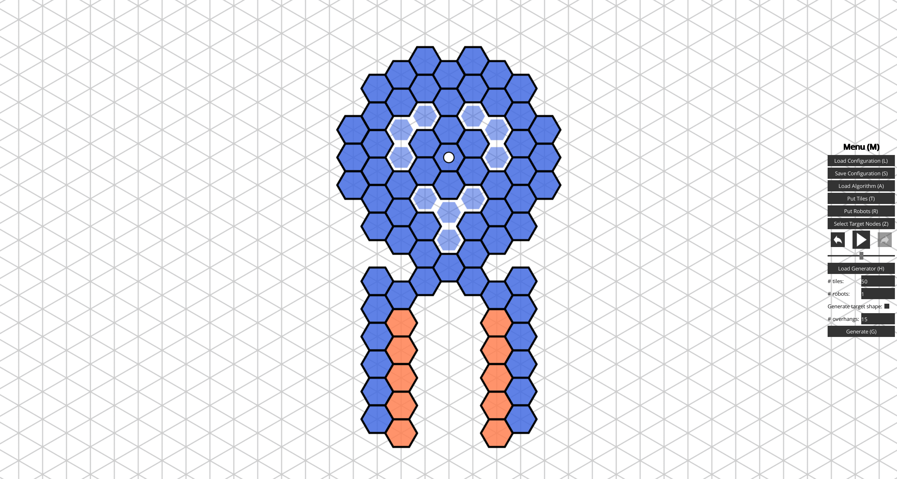

# HybridSim

*HybridSim* is a simulator for the hybrid model for programmable matter. If 
you are unfamiliar with the model, you can read up on it in chapters 6 and 7 of
"Computing by Programmable Particles" by Daymude et al. [1]. I developed 
this program to aid with the development of hybrid model algorithms while 
working on my master's thesis "Shape Reconfiguration by Hybrid Programmable 
Matter" in the Theory of Distributed Systems research group at Paderborn 
University.




## Usage

To be able to launch HybridSim, you need a recent installation of the Java 
Runtime Environment (version 17 or newer). Download and execute the most recent 
`.jar` file from the
[*Releases*](https://github.com/jfriemel/HybridSim/releases/latest) tab on the
right. Alternatively, you can build the executable yourself by cloning the
repository and running `gradlew build`. Then, you find the `.jar` file in the
`lwjgl3/build/lib` directory.

### Basic Features

Using the appropriate buttons in the GUI, you can:

- load a configuration from 
  [`exampleConfigurations`](exampleConfigurations),
- load an algorithm script from 
  [`exampleAlgorithms`](exampleAlgorithms), 
- start the scheduler by pressing the large play button,
- place (left-click) or remove (right-click) tiles, robots, or target 
  nodes,
- load a configuration generator script from
  [`exampleGenerators`](exampleGenerators), and
- generate a configuration with the specified number of tiles, robots, and
  overhangs (tiles on non-target nodes).

### Custom Scripts

Algorithms and configuration generators are implemented as Kotlin scripts.
Use the [`_Template.kts`](exampleAlgorithms/_Template.kts) file from the respective example directory as a
starting point for writing your own scripts which can then be loaded as stated
above. It may also be helpful for you to look at example implementations such
as the script for the
[triangle formation algorithm](exampleAlgorithms/TriangleFormation.kts) by
Gmyr et al. [2].

### CLI Mode

The simulator can also be used to empirically test algorithms in `--nogui` 
mode. For example, to run the shape reconfiguration algorithm for simply 
connected input and target shapes introduced in my thesis on 50 randomly 
generated configurations with 2500 tiles, one robot, and 1000 overhangs, use 
the following arguments:
```
--nogui
--algorithm exampleAlgorithms/ShapeReconfiguration/SC_Input_SC_Target.kts
--generator exampleGenerators/ShapeReconfiguration/SC_Input_SC_Target.kts
--num_tiles 2500 --num_robots 1 --num_overhangs 1000
--num_runs 50 --seed 2023
--output result.csv
```

For a list of all accepted arguments with explanations, run HybridSim with 
`--help`.


## References

[1] Joshua J. Daymude, Kristian Hinnenthal, Andréa W. Richa, Christian 
Scheideler (2019).
Computing by Programmable Particles.
In: *Distributed Computing by Mobile Entities: Current Research in Moving and 
Computing*, pages 615–681.
https://doi.org/10.1007/978-3-030-11072-7_22.

[2] Robert Gmyr, Kristian Hinnenthal, Irina Kostitsyna, Fabian Kuhn, Dorian 
Rudolph, Christian Scheideler, Thim Strothmann (2018).
Forming Tile Shapes with Simple Robots.
In: *DNA Computing and Molecular Programming, 24th International Conference 
(DNA 24)*, pages 122–138.
https://doi.org/10.1007/978-3-030-00030-1_8.
